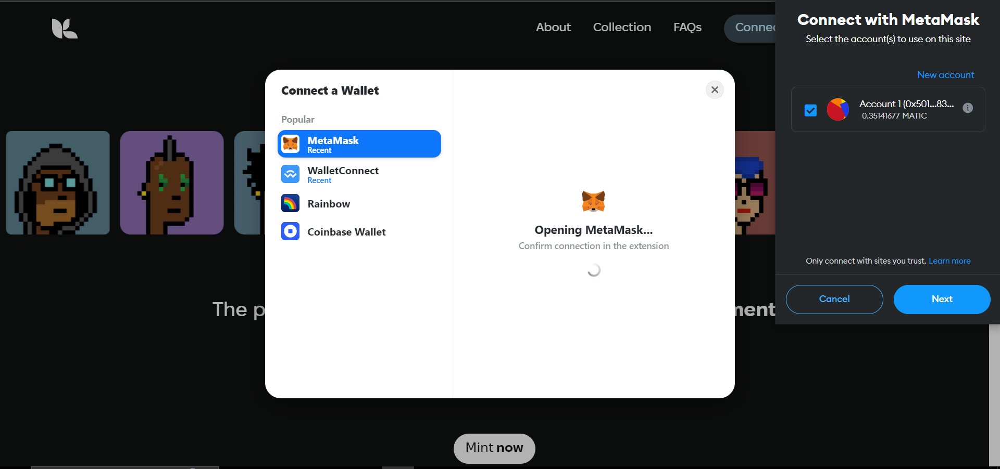

# Giakaa Assignment
## Tech Stack Used
- ReactJS
- TailwindCSS
- RainbowKit
- TypeScript
## Implemented UI Design

## Website Link
https://giakaa-assignment-anmol.vercel.app/

## Why I choose Rainbow Kit
Prior to using Rainbow Kit, I tried using thirdweb and web3modal. While thirdweb is also developer friendly, I believe we can accomplish much more in thirdweb with the aid of the various hooks available. Due to Rainbow Kit's user-friendly wallet connection modals and the fact that it already includes the WalletConnect library, we can achieve the majority of the functionality similar to thirdweb in combination with Wagmi Library.